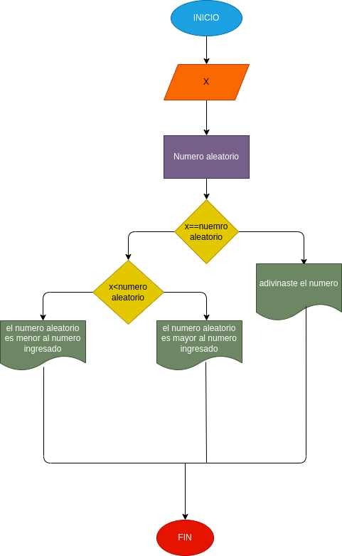

# Adivina_el_numero
juego de adivinarun numero de 1 a 10

# ANALISIS
Variables de entrada
-numero_ingresado =ingrese el numero del 1 a 10

Variables de proceso
-nuemero_aleatorio = genera un numero aleatorio entre 1 a 10
-saber si el numero ingresado es igual al numero aleatorio o el numero ingresado es mayor al numero aleatorio o el numero ingresado es menor a numero aleatorio

# DISEÑO

# CONSTRUCCION